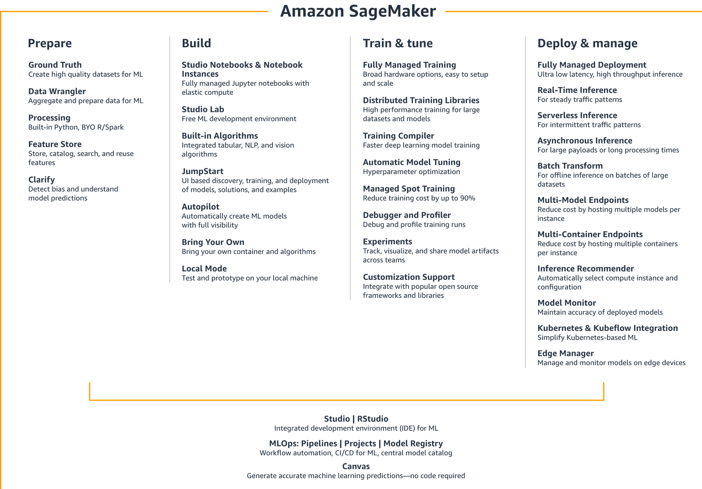
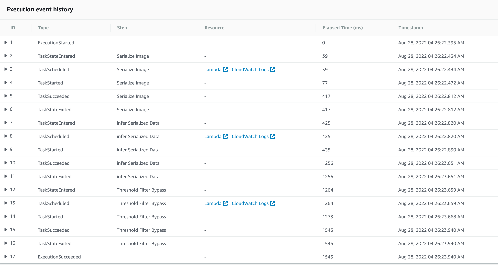
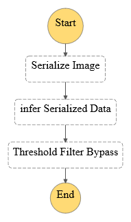

<h1 align="center">ML Workflow for Scones Unlimited</h1>

  <h4></h4>

## :innocent: Motivation

The motive of the project is to build a Machine Learning Model that performs image classification through ML workflows using Amazon's Sage Maker. The Step Functions 
linked with the lambda scripts are used to automate various tasks of Machine Learning process from Data Preparation, Model Creation, Model Deployment and Inference.

## :: Overview Process and AWS Workflow

## :warning: TechStack/framework used

- [AWS SageMaker]
- [AWS Lambda]
- [AWS S3]
- [AWS StepFunction]
- [Python 3.8]
- [Pandas]
- [Numpy]
- [Matplotlib]

## :star: Features
The project involve:
* Building an image classification model that can tell bicycles apart from motorcycles.
* Deploying the trained model to an endpoint.
* Using AWS Lambda Functions to build services to serialize the data, perform inference, and filter out weak inferences.
* Using AWS Step Functions to create an ML workflow to stich the above services together into an event-driven application.

## :file_folder: Dataset
The CIFAR dataaset is open source and generously hosted by the University of Toronto at: https://www.cs.toronto.edu/~kriz/cifar-100-python.tar.gz 

## :star: ML-Workflow Sample

Main three lambda functions:

1. The __Serialize Target Image Data__ takes the address of an image hosted in S3, then serializes and returns a JSON
object.
2. The __image classification__ takes the JSON object returned from 1 and passes it to an end point and collectd the result
as a JSON Object.
3. The __Filtering Low-Confidence Inferences__ takes the inference data from 2 and filters only the images that meet the defined threshold.  

## Execution Flow of the Step Function 

## Step Functions Graph
 .png "Step Functions - After Execution")

## :point_down: Support me here!

